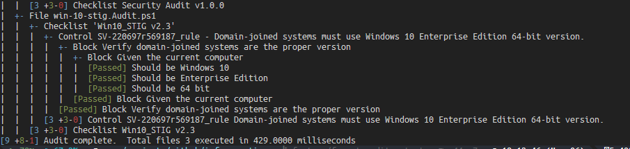

# infraspective : Infrastructure Testing with PowerShell
```yaml
Status: "Under Development (Pre-release)"
Location: https://github.com/aldrichtr/infraspective
Version: 0.3.0
```
## Current status

[](https://github.com/aldrichtr/infraspective/actions/workflows/cicd-run-pssa.yml)
[](https://github.com/aldrichtr/infraspective/actions/workflows/cicd-run-unit-tests.yml)

## Synopsis

`infraspective` is a PowerShell module for testing (auditing, validating) infrastructure using
the [Pester Testing Module](https://pester.dev)

## Description


`infraspective` reads tests (written in [BDD style](https://www.agilealliance.org/glossary/bdd/) , like Pester) and
produces output that reports on compliance of your infrastructure to those tests.

### Predecessors

Originally, [Operation Validation Framework](https://github.com/PowerShell/Operation-Validation-Framework) used
Pester tests organized in particular directories in your module.
[poshspec](https://github.com/TicketMaster/poshspec) added a DSL for making those tests more expressive.
`infraspective` picks up where they left off, using modern Pester (there were some
[breaking changes](https://pester.dev/docs/migrations/breaking-changes-in-v5) from v4 to v5) and adds in some
concepts from other tools to create a Policy as Code tool.

Starting with a test like:
``` powershell
Describe "Services" {
    It "DNS Service should be running" {
        $dns_service = Get-Service -Name 'DNS'
        $dns_service.Status | Should -Be Running
    }
}
```

poshspec gave us the ability to write this like:

``` powershell
Describe "Services" {
    Service DNS Status { Should -Be Running }
    # i fixed it up for v5 a little
}
```

  `infraspective` picks up where these left off.

## Additional language features

At this time (version 0.2) `infraspective` adds three new structures to organize and classify tests:

- Control
- Grouping
- Checklist


### Control

A `Control` is `0 or more tests + metadata`.  If you have experience with NIST STIGs then this example might look
familiar:

``` powershell
Control "SV-220697r569187_rule" -Resource "Windows" -Impact "medium" -Reference 'CCI:000366'-Title (
    "Domain-joined systems must use Windows 10 Enterprise Edition 64-bit version.") -Description (
        "Credential Guard use virtualization based security to protect...") {
            Describe "Verify domain-joined systems are the proper version" {
                BeforeAll {
                    $v = Get-WindowsVersion
                }
                It "Should be Windows 10" {
                    $v.ProductName | Should -match '^Windows 10'
                }
                It "Should be Enterprise Edition" {
                    $v.EditionID | Should -match 'Enterprise'
                }
                It "Should be 64 bit" {
                    [Environment]::Is64BitOperatingSystem | Should -BeTrue
                }
            }
        }
```

### Grouping

A `Grouping` is a logical collection of 0 or more `Grouping`s and or `Control`s.  Meaning Groupings
can be nested to provide whatever structure you need.  Continuing our Windows 10 STIG example:

``` powershell
Grouping "V-220697" -Title "SRG-OS-000480-GPOS-00227" {
    Control "SV-220697r569187_rule" -Resource "Windows" -Impact "medium" -Reference 'CCI:000366'-Title (
        "Domain-joined systems must use Windows 10 Enterprise Edition 64-bit version.") -Description (
            "Credential Guard use virtualization based security to protect...") {
                Describe "Verify domain-joined systems are the proper version" {
                    BeforeAll {
                        $v = Get-WindowsVersion
                    }
                    It "Should be Windows 10" {
                        $v.ProductName | Should -match '^Windows 10'
                    }
                    It "Should be Enterprise Edition" {
                        $v.EditionID | Should -match 'Enterprise'
                    }
                    It "Should be 64 bit" {
                        [Environment]::Is64BitOperatingSystem | Should -BeTrue
                    }
                }
            }
}
```

### Checklist

Next, one or more Controls together create a `Checklist`.  A `Checklist` is a collection of `Control`s that define a
given audit criteria.  Since we are already using the example so far, a Checklist would be analogous to the
[Windows 10 STIG Version 2](https://stigviewer.com/stig/windows_10/)

``` powershell
Checklist "MS Windows 10 STIG V2R3" -Title "Microsoft Windows 10 Security Technical Implementation Guide" -Version
'3.2.2.36079' {
    Grouping "V-220697" -Title "SRG-OS-000480-GPOS-00227" {
        Control "SV-220697r569187_rule" -Resource "Windows" -Impact "medium" -Reference 'CCI:000366'-Title (
            "Domain-joined systems must use Windows 10 Enterprise Edition 64-bit version.") -Description (
                "Credential Guard use virtualization based security to protect...") {
                    Describe "Verify domain-joined systems are the proper version" {
                        BeforeAll {
                            $v = Get-WindowsVersion
                        }
                        It "Should be Windows 10" {
                            $v.ProductName | Should -match '^Windows 10'
                        }
                        It "Should be Enterprise Edition" {
                            $v.EditionID | Should -match 'Enterprise'
                        }
                        It "Should be 64 bit" {
                            [Environment]::Is64BitOperatingSystem | Should -BeTrue
                        }
                    }
                }
    }
}
```

## Notes

In keeping with Pester's convention of a directory of files name `*.Tests.ps1`, `infraspective` looks for files
named `*.Audit.ps1`

## Example

```powershell
Import-Module infraspective
Invoke-Infraspective
```

